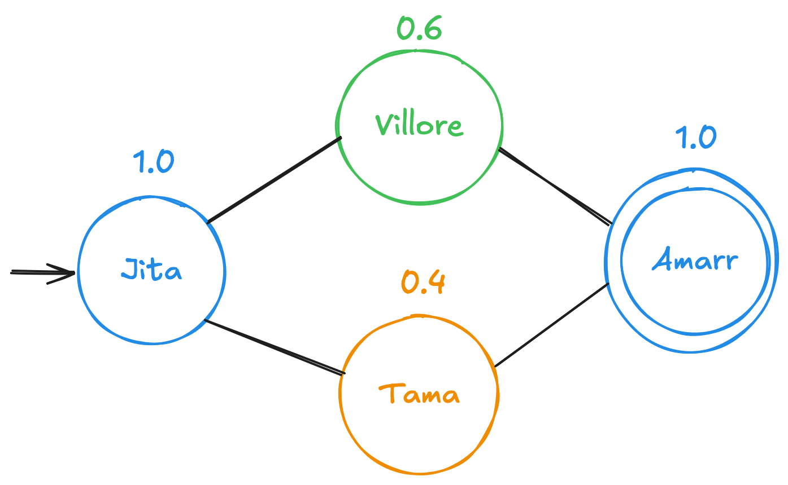

# eve-astar

> **IMPORTANT**  
> This function is already built-in the game. This project applies what I learnt in my `Heuristics and Optimization` classes for implementing an A* algorithm.

EVE Online is commonly known for having a massive size for travelling across solar systems... In fact, it has over 7500 different systems. That number can be massive, especially when you are trying to go from point A to point B.

**eve-astar** is a personal project for deepening into heuristics and search algorithms.

Made in **C++ for optimization**, it has been implemented from zero to hero.

> **NOTE**  
> Do not worry. All decision choices, a more detailed description of the problem, and more are being detailed in the following [paper](docs/EVE_Astar.pdf)

---

## Use-Cases

1. Given the map of a region/constellation, the origin point (A) and the destination point (B), you want to **travel using the shortest _and safest_ route possible**.
2. Given the map of a region/constellation, the origin point (A) and the destination point (B), you want to **travel using the shortest route possible**.
3. Given the map of a region/constellation, the origin point (A) and the destination point (B), you want to **travel using the unsafest security route**.

Please, enjoy this as much as I have (probably not, it is going to be a nightmare) coding it.

---

## The Process

A\* is a **Best-First** algorithm that uses a heuristic `h(x)`:


$$h(x) = f(x) + g(x)$$

Where:

- `f(x)` is **Dijkstra's Algorithm**. Why Dijkstra? Because it's an excellent brute-force algorithm.
- `g(x)` is a custom heuristic. Since we want to travel through the **safest path**, we prioritize nodes that **maximize** the highest CONCORD security between their adjacent systems.

---

## Tests

A battery of tests can be executed. The `.txt` files follow this format:

```
Origin
Destination
System1,Concord_sec_status1,AdjSystem1(distance),AdjSystem2(distance), ... AdjSystemN(distance) 
System2,Concord_sec_status2,AdjSystem1(distance),AdjSystem2(distance), ... AdjSystemN(distance)

...

SystemN,Concord_sec_status2,AdjSystem1(distance),AdjSystem2(distance), ... AdjSystemN(distance)
```

Currently, the input reader is... not great. Do not blame me, it wasn’t the important part. Yes, I need to fix it. Any possible issues you may find:

- Segfault because you didn't follow the format
- Weird graph nodes because you didn't follow the format

> **CAUTION**  
> Please follow the format carefully.

For example, here is a simplified version of one test:



Here, we must avoid, at all costs, the *insecure systems* (`-1.0 <= sys_status <= 0.4`). Then, the only possible path is:

`Jita -> Villore -> Amarr`, as none of them are considered insecure.

Obviously, there are more complex cases that won't considered here, but treated as part of the tests. Do not hesitate and try your files with this $A^*$. If you detect any problem, please raise an issue to discuss about it.


